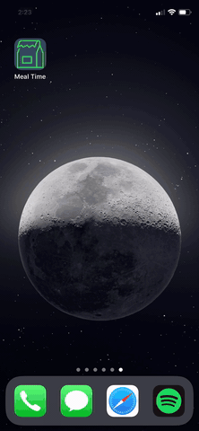

# Meal Time

`portfolio`

A simple Django REST API that will serve a lunch menu. This API is accessed by the iOS app that is included in this repo.

Live API available here: https://afternoon-stream-26309.herokuapp.com and deployed on Heroku. Please note this api is running on the free Heroku tier therefore the app may appear to take longer to startup for the first time. Heroku spins down the node that this api lives on when not in use. Subsequent app launches are much faster.

This project is strictly for learning purposes and is not intended for production use. The iOS app is not feature filled, it's simply there to GET data from the REST API and display it in a nice way on an iOS app. I got this idea from wanting to understand the whole ecosystem, or at least as much as possible, that's what inspired this project. I wanted to create a REST API that could be accessed online then, inside an iOS app, retrieve that data and display it in a TableView. Each table view cell is rendered based off of a single .xib file which allows for multiple UILabels.

### Technology used
* Swift 5
* Python
* Django REST framework

### Usage
* Open the XCode project under `MealTime/iOS/iOS.xcodeproj` and build+run, the app should launch in the iOS simulator and connect to the live API.
* Must target iOS 13+

  

